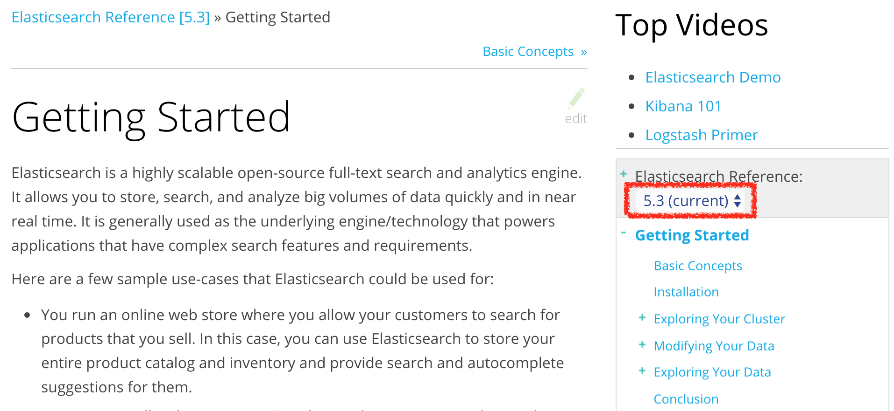

# 한국 Elasticsearch 사용자 그룹 Resources

Elasticsearch 관련 자료 및 링크들을 모아놓는 곳입니다.

#### 목차
- [Elastic 공식](#elastic-공식)
- [커뮤니티](#커뮤니티)
- [추천 컨텐츠](#추천-컨텐츠)

## Elastic 공식
### 한국 오피스
> 주소: 서울특별시 영등포구 국제금융로 10 TWO IFC 22층 07326  
> 전화번호: +82 2 6138 3537  
> 대표메일: korea-team@elastic.co  

### 웹사이트
- 홈페이지: https://www.elastic.co/kr
- 프로덕트 페이지: [소개](https://www.elastic.co/kr/products)
  - elasticsearch: [소개](https://www.elastic.co/kr/products/elasticsearch) - [다운로드](https://www.elastic.co/kr/downloads/elasticsearch)
  - kibana: [소개](https://www.elastic.co/kr/products/kibana) - [다운로드](https://www.elastic.co/kr/downloads/kibana)
  - beats: [소개](https://www.elastic.co/kr/products/beats) - [다운로드](https://www.elastic.co/kr/downloads/beats)
  - logstash: [소개](https://www.elastic.co/kr/products/logstash) - [다운로드](https://www.elastic.co/kr/downloads/logstash)
  - x-pack: [소개](https://www.elastic.co/kr/products/x-pack) - [설치](https://www.elastic.co/kr/downloads/x-pack)
  - cloud: [소개](https://www.elastic.co/kr/cloud) - [사용](https://cloud.elastic.co/)
- 블로그: [한글](https://www.elastic.co/kr/blog), [영문](https://www.elastic.co/en/blog) - 한글은 일부 번역된 포스트만 있고, 영문 블로그에 포스트가 더 많습니다
- 교육: https://www.elastic.co/training
- 사용 사례: https://www.elastic.co/use-cases
- 포럼: https://discuss.elastic.co/

### 도큐먼트
공식 홈페이지 도큐먼트는 우측 또는 상단의 버전 넘버가 적힌 드랍박스를 클릭하여 선택하면 다른 버전의 동일한 컨텐츠 페이지로 이동합니다.

홈페이지 도큐먼트의 소스들은 각 프로덕트별 GitHub 레파지토리에 asciidoc 문서로 관리되어 있으며 오타 등의 정정 요청은 깃헙의 풀 리퀘스트 기능으로 가능합니다.

#### Documentation 
Elastic 공식 도큐먼트 

- [전체 웹페이지](https://www.elastic.co/guide/index.html)
- elasticsearch: [웹페이지](https://www.elastic.co/guide/en/elasticsearch/reference/current/index.html) - [GitHub](https://github.com/elastic/elasticsearch/tree/master/docs/reference)
- kibana: [웹페이지](https://www.elastic.co/guide/en/kibana/current/index.html) - [GitHub](https://github.com/elastic/kibana/tree/master/docs)
- logstash: [웹페이지](https://www.elastic.co/guide/en/logstash/current/index.html) - [GitHub](https://github.com/elastic/logstash/tree/master/docs)
- beats 
  - Packetbeat: [웹페이지](https://www.elastic.co/guide/en/beats/packetbeat/current/index.html) - [GitHub](https://github.com/elastic/beats/tree/master/packetbeat/docs)
  - Metricbeat: [웹페이지](https://www.elastic.co/guide/en/beats/metricbeat/current/index.html) - [GitHub](https://github.com/elastic/beats/tree/master/metricbeat/docs)
  - Filebeat: [웹페이지](https://www.elastic.co/guide/en/beats/filebeat/current/index.html) - [GitHub](https://github.com/elastic/beats/tree/master/filebeat/docs)
  - Winlogbeat: [웹페이지](https://www.elastic.co/guide/en/beats/winlogbeat/current/index.html) - [GitHub](https://github.com/elastic/beats/tree/master/winlogbeat/docs)

#### Elasticsearch The Definitive Guide
오라일리 미디어에서 출판중인 서적 입니다. 저작권이 Elastic 사 에게 있어 현재 Elastic 사 홈페이지에서 전체 내용을 볼 수 있습니다. 서적 버전은 1.x, 웹 버전은 2.x 입니다.
- 저자: Clinton Gormley, Zachary Tong
- [웹페이지](https://www.elastic.co/guide/en/elasticsearch/guide/current/index.html)
- [Github](https://github.com/elastic/elasticsearch-definitive-guide)
- [O'Reilly book](http://shop.oreilly.com/product/0636920028505.do)

#### 비디오 & 웨비나: 
https://www.elastic.co/videos

#### 소개 자료
- 리플릿: [한글](https://drive.google.com/file/d/0ByqsUCpttxAGeTNOMWNCQmo4eUU/view), [영문](https://drive.google.com/file/d/0ByqsUCpttxAGd1VtaTY5a0pLNXM/view)

## 커뮤니티
- 한국 Elasticsearch 페이스북 그룹: https://www.facebook.com/groups/elasticsearch.kr
- 한국어 사용자 포럼: https://discuss.elastic.co/c/in-your-native-tongue/korean
 
## 추천 컨텐츠
### 공식 블로그

### 개인 블로그 및 컨텐츠
#### 정호욱

#### 허광남

#### 김종민

### 예제
